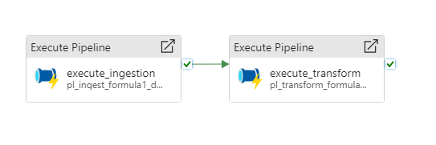
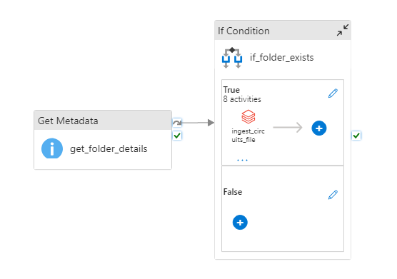
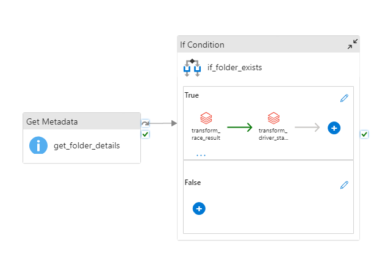
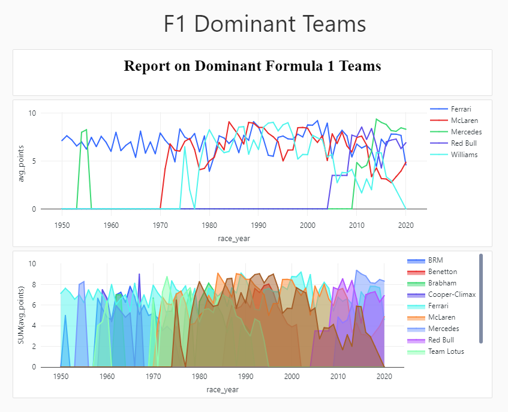
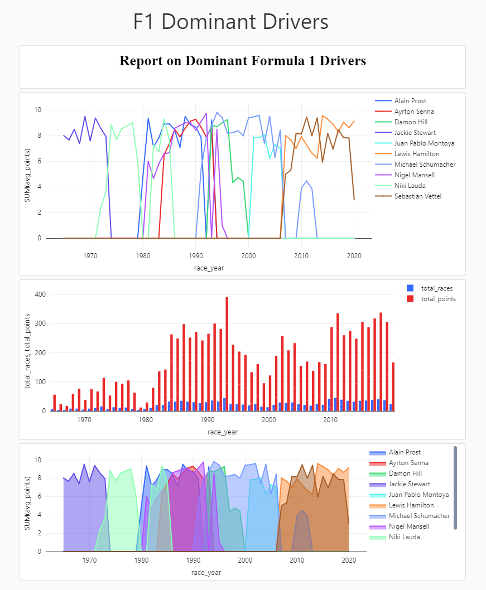

# Formula1

An ADF Pipeline with pySpark, data lake and Databricks for [Formula1 data](http://ergast.com/mrd/db/#csv)

  <h4>Data Factory Pipeline</h4>
  
  

     
     
  

  <h4>Dashboard For Analysis Dominant Teams</h4>
  

     
  

  <h4>Dashboard For Analysis Dominant Drivers</h4>
  

     
  

  <h4>Dashboard For Analysis Dominant Teams</h4>
  

     
  

